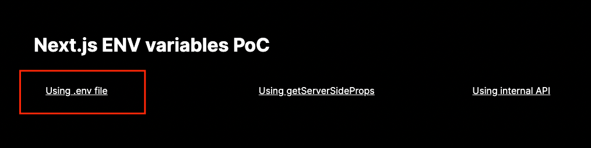
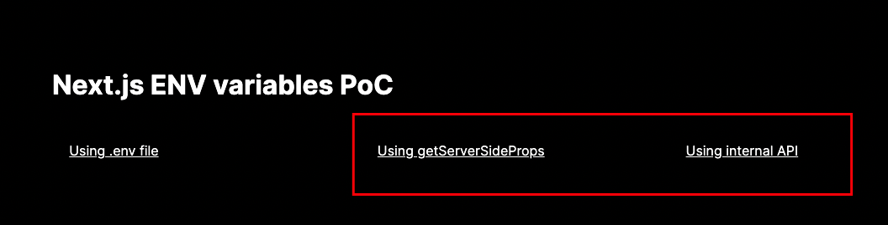

# Next.js ENV variables PoC

## ENV variable baked in at build time

Available on both server and client side.

Run

`npm run build:integration` (need to specify the name of the environment)

then

`npm run start`

Only the following use case is valid.

## ENV variable passed in at run time

Available on the server side only.

Run

`npm run build`

then

`npm run start:ci`

Only the following use cases are valid.

